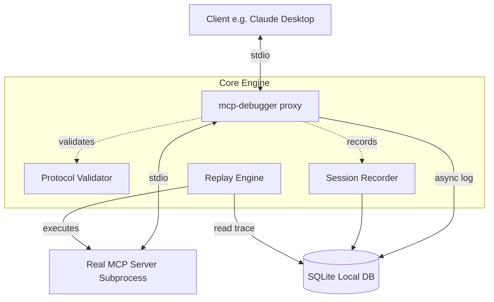

# Architecture Deep Dive

## Component Diagram (ASCII)

```text
  [Client (e.g. Claude Desktop)]
                │
         (stdin / stdout)
                │
                ▼
     [mcp-debugger proxy]  ──────────►  [SQLite Local DB]
                │                       (~/.mcp-debugger/sessions.db)
         (stdin / stdout)
                │
                ▼
      [Real MCP Server]
```

### Flow Architecture (Mermaid)



---

## Module Responsibilities

### [proxy/stdio_proxy.py](file:///d:/python/MCP_DEBUG/src/mcp_debugger/proxy/stdio_proxy.py)
- **Subprocess Management**: Launches the real target server subprocess using `asyncio.create_subprocess_exec` / `create_subprocess_shell`.
- **Bidirectional Piping**:
  - Intercepts messages written by the client to `sys.stdin` and pipes them to the server's standard input.
  - Intercepts messages written by the server to its standard output and pipes them to the client's standard output (`sys.stdout`).
- **Intercept & Parse**: Every message flowing through the pipes is parsed as JSON-RPC, routed to the validator and recorder, and then forwarded immediately.
- **Backpressure & Concurrency**: Leverages non-blocking asynchronous tasks (`asyncio.gather`) so that database logging overhead or slower validations do not block the active communication stream between the client and server.

### [protocol/validator.py](file:///d:/python/MCP_DEBUG/src/mcp_debugger/protocol/validator.py)
- **Protocol Compliance**: Compares captured JSON-RPC messages against the official Model Context Protocol (MCP) specification schemas.
- **Checks Performed**:
  - Correct JSON-RPC 2.0 handshake envelope.
  - Correct initialization sequence (e.g., client must call `initialize`, server must respond, client must notify `initialized`).
  - Validation of tool input/output JSON schemas in `tools/list` and `tools/call`.
- **Validation Reporting**: Returns structured check summaries (`passed`, `severity`, `message`, `suggestion`) that can raise warnings or block builds in a CI environment.

### [storage/database.py](file:///d:/python/MCP_DEBUG/src/mcp_debugger/storage/database.py)
- **Async Threading/Aiosqlite**: Provides thread-safe, asynchronous operations to interact with the SQLite local database.
- **Bootstrap Schema**: Handles automated schema creation (`sessions`, `messages`, `tools`, `errors`) on first run or database initialization.
- **Write Actions**: Exposes async methods such as `create_session()`, `log_message()`, `log_tool()`, `log_error()`, and `close_session()`.

### [replay/engine.py](file:///d:/python/MCP_DEBUG/src/mcp_debugger/replay/engine.py)
- **Session Load**: Reads all historical messages logged in a given session where `direction = 'client_to_server'`.
- **Simulation**: Spins up the server subprocess in isolation and replays these client-to-server messages sequentially.
- **Response Validation**: Captures new server responses and executes a deep difference operation against the historical server responses recorded in the database.

---

## Data Flow (Replay Mode)

1. **Invocation**: The user executes:
   ```bash
   mcp-debugger replay <session_id> --server "target-server-command"
   ```
2. **Load Stage**: The `ReplayEngine` queries the SQLite database to fetch all client-to-server requests and notifications belonging to the target `session_id`, sorted chronologically.
3. **Execution Stage**: A new server subprocess is spawned. The engine loops over the loaded messages and writes them to the server's standard input.
4. **Capture Stage**: The engine reads the server's standard output, matching responses back to their corresponding request IDs.
5. **Diff & Analysis Stage**: The replayed responses are compared with the original responses retrieved from the database. A side-by-side comparison table is rendered, and differences are highlighted.

---

## Error Handling Strategy

- **Subprocess Crash**: If the target server subprocess exits prematurely, the proxy catches the termination, logs a fatal error state to the database, closes the session, and exits with code `1`.
- **Malformed JSON-RPC Lines**: If either client or server prints arbitrary text or invalid JSON lines (such as debug print statements), the proxy logs a warnings category event, stores it as raw text, but forwards the raw bytes transparently to prevent session breakage.
- **Database Write Failures**: SQLite database writes are executed out-of-band relative to the proxy forward stream. If database connectivity fails or becomes locked, write operations retry up to 3 times before fallback logging to `sys.stderr` is used. This prevents database bottlenecks from freezing the active proxy pipe.
