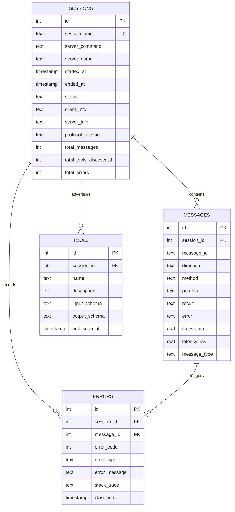

# Database Schema & Migrations Plan

This document details the database engine selection, connection policies, database schema, index details, and the migration strategy for **MCP Debugger**.

---

## Database Architecture

### Engine Selection: SQLite
- **Rationale**: Since `mcp-debugger` is a local-first developer tool, SQLite is chosen because it requires **zero configuration**, is stored as a single file, features a tiny resource footprint, and is included in the Python standard library (`sqlite3`).
- **Storage Location**: By default, the database is stored at:
  `~/.mcp-debugger/sessions.db` (automatically created on first boot).
- **Concurrency & Threads**: SQLite writes are performed inside an async thread pool or using `aiosqlite` to avoid blocking Python's async event loop. We enable **WAL (Write-Ahead Logging)** mode on initialization to allow concurrent reads during active database writes.

---

## Database Schema Diagram (Logical)



---

## Detailed Schema Reference

### 1. Table `sessions`
Stores metadata about each proxy run.
- `id`: Autoincrement integer ID.
- `session_uuid`: Random UUIDv4 string representation for external referencing.
- `server_command`: The full terminal command executed to spin up the target server.
- `status`: Lifecycle of the session (`running`, `completed`, `error`, `terminated`).
- `client_info`/`server_info`: Extracted capabilities JSON string.

### 2. Table `messages`
The high-throughput log recording JSON-RPC exchanges.
- `direction`: Enum `client_to_server` or `server_to_client`.
- `timestamp`: Monotonic epoch time (represented as a real number) to ensure correct sequence sorting independent of system clock drifts.
- `latency_ms`: Calculated only for responses. Obtained by computing:
  $$\text{latency\_ms} = (\text{timestamp}_{\text{response}} - \text{timestamp}_{\text{request}}) \times 1000$$

### 3. Table `tools`
Saves structural schemas of tools discovered during `tools/list`.
- `input_schema`: Cleaned JSON string conforming to draft-07 JSON Schema specs. Used by the Validator to verify subsequent `tools/call` parameters.

### 4. Table `errors`
Categorized system and application errors.
- `error_type`: High-level categories (`protocol_error`, `tool_execution_error`, `timeout_error`, `connection_error`).

---

## Indexes & Performance Tuning

To support rapid filtering during CLI inspections (e.g. `mcp-debugger inspect <id> --method tools/call`), the following indexes are generated during setup:

```sql
-- Fast message lookup and chronological sorting per session
CREATE INDEX IF NOT EXISTS idx_messages_session_time
ON messages (session_id, timestamp);

-- Instant method searching
CREATE INDEX IF NOT EXISTS idx_messages_method
ON messages (method);

-- Session queries by UUID
CREATE UNIQUE INDEX IF NOT EXISTS idx_sessions_uuid
ON sessions (session_uuid);
```

---

## Database Migrations Plan

To ensure a lightweight deployment and eliminate external library dependencies (like `Alembic` or `yoyo-migrations`), the database schema versioning is managed natively by a lightweight runner in `database.py`.

### Migration Schema: Table `schema_version`
A single table is created to track the current database version:

```sql
CREATE TABLE IF NOT EXISTS schema_version (
    version INTEGER PRIMARY KEY,
    applied_at TIMESTAMP DEFAULT CURRENT_TIMESTAMP
);
```

### Migration Execution Flow
1. **Startup Check**: On database instantiation, the engine queries the `schema_version` table. If the table does not exist, it defaults to Version `0`.
2. **Sequential Upgrades**: In-code migration scripts are stored sequentially in a dictionary or list within Python:
   ```python
   MIGRATIONS = {
       1: "ALTER TABLE sessions ADD COLUMN server_name TEXT;",
       2: "CREATE INDEX IF NOT EXISTS idx_messages_method ON messages (method);",
       # Future migrations added here...
   }
   ```
3. **Transaction Safety**: Upgrades are run inside a database transaction (`BEGIN TRANSACTION` / `COMMIT`). If any step in a migration fails, the transaction is rolled back, and database startup halts with an error.
4. **Pragmas**:
   - `PRAGMA foreign_keys = ON;` is executed on every database connection to enforce referential integrity.
