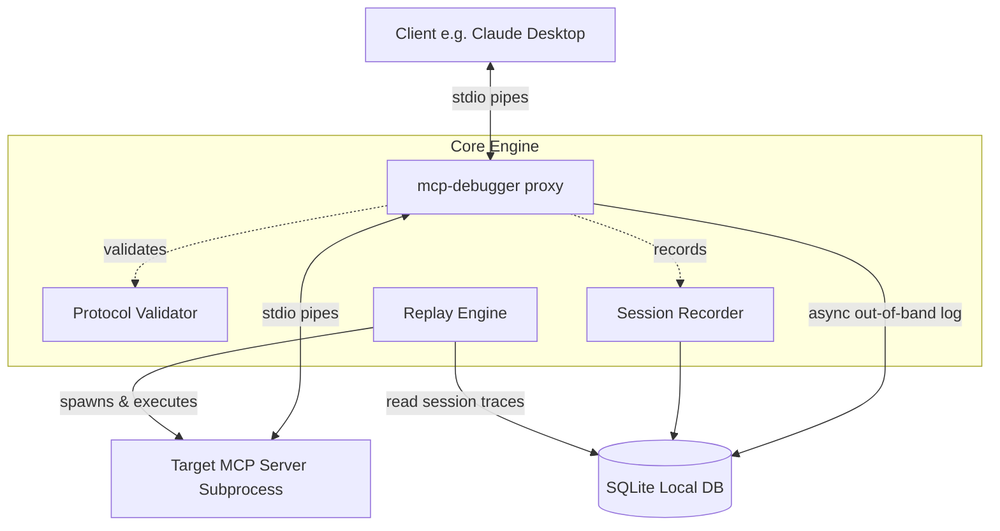
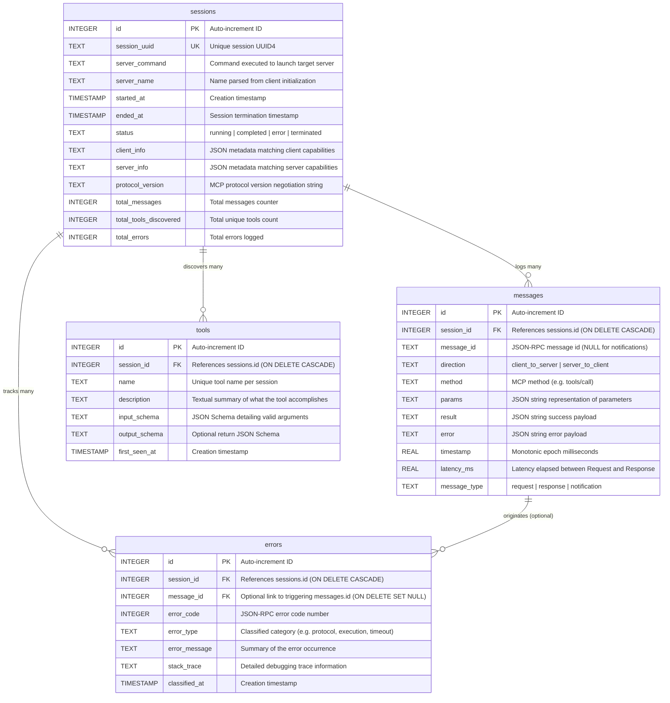
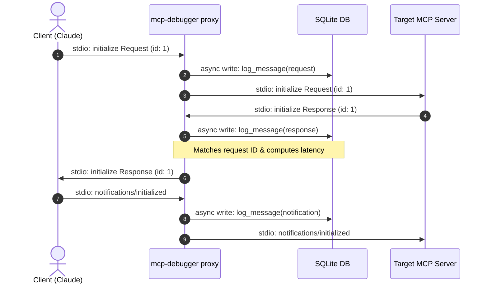
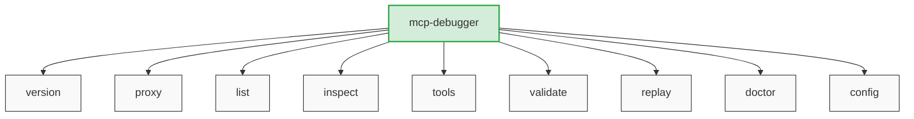

# MCP Debugger Diagrams & Architecture Visualizations

This directory contains visual Mermaid diagrams explaining the Model Context Protocol (MCP) Debugger's architecture, data models, system flows, and subcommand hierarchies.

---

## 1. System Architecture & Component Flow

The proxy operates as an asynchronous man-in-the-middle stdio pipe between the MCP Client (like Claude Desktop) and the target MCP Server subprocess.

---

## 2. Database Entity-Relationship Diagram (ERD)

All historical sessions, protocol messages, tool specifications, and classified errors are persisted under `~/.mcp-debugger/sessions.db`.

---

## 3. Communication & Logging Sequence Diagram

This sequence traces the initialization phase where the proxy routes messages, logs them async to SQLite, and maintains transparent communication.

---

## 4. CLI Subcommand Structure

